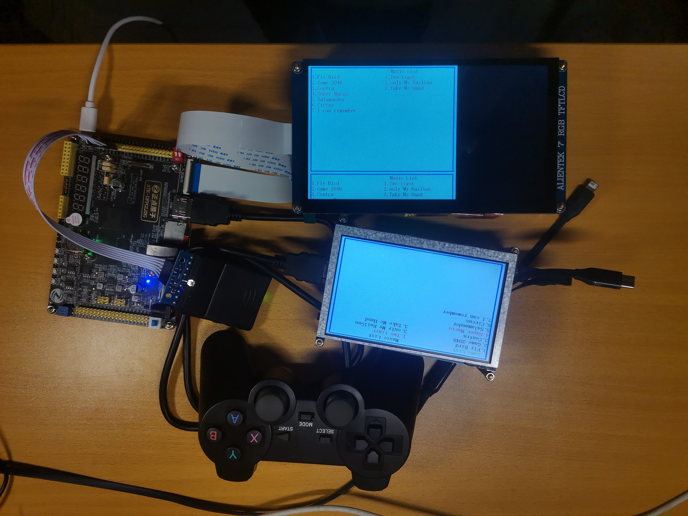
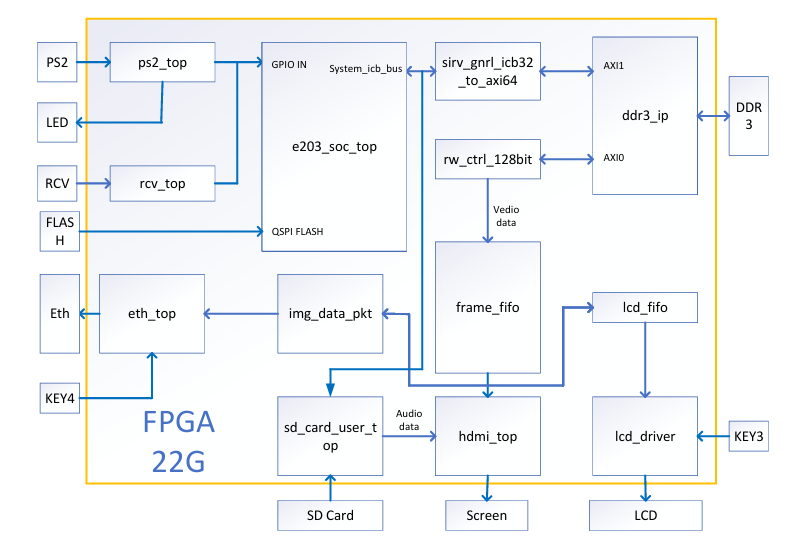
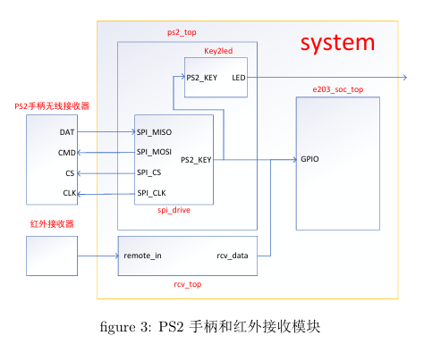
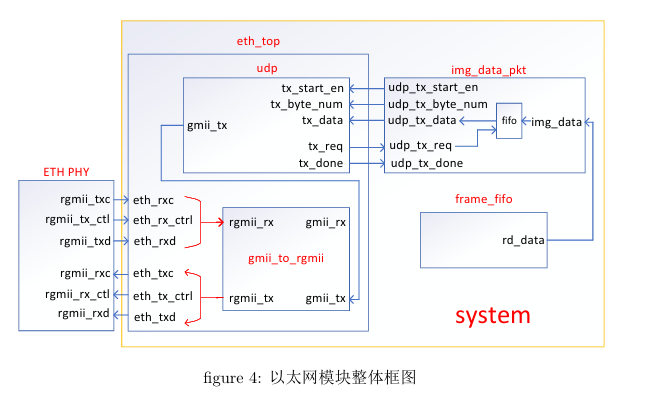
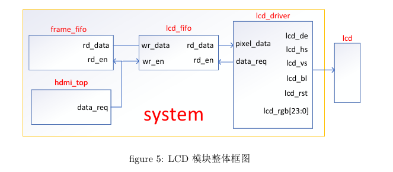
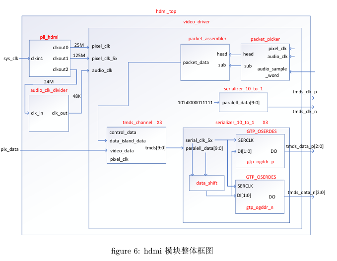
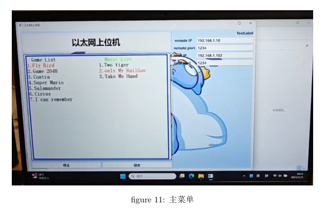
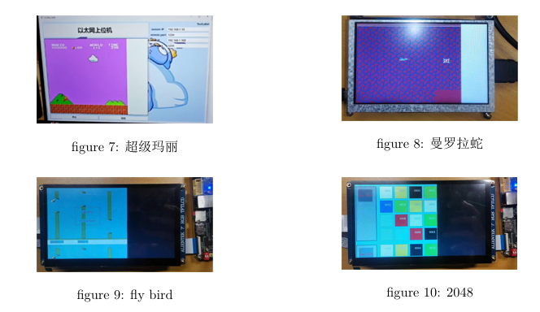

# 基于RISC-V的多功能游戏机

## 目录

- [基于RISC-V的多功能游戏机](#基于risc-v的多功能游戏机)
  - [项目概述](#项目概述)
  - [代码结构](#代码结构)
  - [作品全貌图](#作品全貌图)
  - [设计目标](#设计目标)
  - [主要技术特点](#主要技术特点)
  - [关键性能指标](#关键性能指标)
  - [系统组成及功能说明](#系统组成及功能说明)
    - [系统框架](#系统框架)
    - [模块介绍](#模块介绍)
  - [完成情况及性能参数](#完成情况及性能参数)
    - [基础功能](#基础功能)
    - [扩展功能](#扩展功能)
    - [可拓展之处](#可拓展之处)
  - [参考文献](#参考文献)

## 项目概述

本项目基于紫光同创FPGA平台，采用RISC-V架构设计并实现了一款多功能游戏机，能够运行NES模拟器，支持多种外设，并能够接收和解析控制信号。其设计目的是创建一个灵活可扩展的游戏平台。

## 代码结构

├── **e203**                  # FPGA 代码

├── **HBirdv2_Prj**          # 软件代码

├── **bin_generate**          # 将软件代码转为可以用 Pango 开发软件烧录器直接烧录的 SFC 文件，注意选择烧录地址

├── **以太网上位机**           # 自制的以太网上位机

└── **快速验证比特流**         # 将其内的文件依次烧录进 FLASH 即可验证整个工程

## 作品全貌图

## 设计目标

- **平台**：基于紫光同创FPGA
- **架构**：RISC-V处理器
- **功能**：运行NES模拟器，支持多款游戏和外设

## 主要技术特点

- 移植RISC-V到FPGA，并设计多款趣味游戏。
- 采用DDR3和FLASH，提供充足的内存空间。
- FPGA直接驱动多个外设，CPU负责调度。
- 游戏切换灵活，音频存储在SD卡中。

## 关键性能指标

- **CPU主频**：50MHz
- **Dhrystone跑分**：1.28DMIPS/MHz
- **视频输出**：支持HDMI输出640x480@(60Hz)视频，音频采样率为48kHz
- **接口支持**：支持PS2手柄和红外遥控
- **传输**：千兆以太网支持视频传输

## 系统组成及功能说明

### 系统框架

整体框架图见figure1。其中’e203_soc_top’为蜂鸟e203RISC-V内核，主频为50M，负责全局的
控制。其左边的’ps2_top’和’rcv_top’分别为PS2手柄和红外遥控解析模块，其解析出的按键值通过
GPIO传给e203内核。PS2解析模块解析出的按键值同时通过LED展示。’sirv_gnrl_icb32_to_axi64’
负责将e203的32位的icb系统总线转换位64位的axi总线，从而可以通过‘ddr3_ip’模块的AXI1
接口访问ddr3。e203也有专用的接口用于访问FLASH，还可以通过系统总线控制SD卡读写模块。
’rw_ctrl_128bit’模块从’ddr3_ip’模块的AXI0接口访问ddr3，从中读取出视频数据送入’frame_fifo’
帧缓冲模块。该模块的输出又接给三个模块，分别是’hdmi_top’模块，’img_data_pkt’模块和’lcd_fifo’
模块。其中’lcd_fifo’模块用于再次缓冲视频数据，其输出接给’lcd_driver’模块，该模块为用于驱动
LCD屏幕。’img_data_pkt’模块将读取的视频数据从16位拼接为32位，并在每帧的第一个像素数据
前插入控制信息，之后存入内部的fifo中。’eth_top’模块从’img_data_pkt’模块内部的fifo中读取数
据作为UDP协议中的数据段数据，最后驱动以太网传输数据。
’sd_card_user_top’模块从SD卡中读取音频数据传输给’hdmi_top’模块。’hdmi_top’模块将获
取的音频数据和视频数据通过hdmi接口输出。

  

系统的核心是蜂鸟e203 RISC-V内核，负责全局控制。系统通过多个模块实现功能：

- **PS2手柄和红外遥控解析模块**：这两个模块分别负责解析ps2手柄和红外遥控器发送来的信号，从中获取出按键值。解析出的按键
值直接连接至e203 内核的GPIO 输入，从而程序设计时只需要读取GPIO的输入值即可判断按键值，
示意图见figure3。

- **iCB总线至AXI总线转换模块**：由于蜂鸟e203 内核使用的总线是32位的ICB(Internal Chip Bus)，而 DDR3 IP 模块提供的用户
接口是AXI总线，且最小宽度为64位。因此e203访问DDR3时需要先将32位ICB总线转换为64
位AXI 总线。蜂鸟e203 源代码中提供了将32位的ICB总线转换为32位的AXI总线的模块，因此
只需要稍加修改即可。

- **DDR3 AXI0接口读写控制模块**：该模块会不断的从DDR3的地址0x00200000处突发读出图片数据送入图形帧缓冲模块，其他模块
从图形帧缓冲模块中读图形数据送往各自的驱动模块显示出图片。每秒读取60次，每次读取640*480的16bit数据，吞吐量为60*640*480*16=295Mbps，而ddr3ip模块提供的最大传输速率为1000Mbps，
因此能够满足需求。

- **以太网模块**：该模块是基于正点原子的PGL22G开发板例程修改的，整体框图见figure4。’img_data_pkt’模块
将读取的16位像素拼接成32位，并在每帧的开始插入额外的控制信息，然会存入内部的fifo中供udp
模块读取。同时’img_data_pkt’会给出每一包传输的数据长度以及开始传输信号。udp模块按照UDP
协议将数据封装成包，通过GMII接口(GigabitMediumIndependentInterface)传输给以太网物理层。
由于外接的以太网PHY芯片使用的是RGMII接口(ReducedGMII)，因此还需要由’gmii_to_rgmii’
模块进行接口转换。因为不需要通过以太网接收数据，因此udp模块只实现了发送功能，没有接收功
能。接收方的IP地址固定且采用广播MAC地址，因此也不需要利用ARP协议(AddressResolution
 Protocol)进行地址解析。
上位机利用控制信息定位每帧的第一个数据包，然后接收480个数据包后开始解析数据，恢复出图
片。上位机是我们团队自己编写的。

- **LCD和HDMI模块**：帧缓冲模块的读信号是由hdmi模块给出的，而hdmi模块和LCD模块的时钟域并不一致，因此
需要将像素数据再次通过fifo 缓存。hdmi 输出的分辨率为 640*480，而我们使用 LCD 屏幕分辨率为
1024*600，因此驱动 LCD 屏幕时只驱动了左上角的640*480区域，其余部分像素值给0。但是若仍然按
照1024*600@(60Hz) 的参考时序参数驱动 LCD 屏幕，则需要的缓冲 fifo 过大，因此我们魔改了 LCD
屏幕的时序参数。HDMI模块是基于github上的开源模块修而来的，源代码位于:https://github.com/hdl
util/hdmi，首先将系统的50M时钟作为参考时钟，用锁相环生成三个时钟，频率分别为25M，125M,24M。其中25M时钟作为像素时钟，125M时钟作为并串转换的参考时钟。24M时钟在进行500分频生成48K
的时钟作为音频信号采样时钟。
’tmds_channel’模块完成视频数据，数据岛数据和控制数据的编码，生成长度为10比特的并行数
据。该并行数据送入’serializer_10_to_1’模块进行并串转换，由于该模块的输入时钟为像素时钟的5
倍，因此只需要进行2:1的并串转换，一共进行5次，从而将10比特的并行数据转换为串行数据，且
输出的是串行信号是差分信号对。
’packet_picker’模块将输入的音频数据封装成包，包括3个字节的包头head和4*7个字节的包体
sub。’packet_assembler’模块完成音频数据包的校验位计算，最终生成完整的音频数据包。

- **SD卡模块**：该模块通过SPI协议不断读取SD里的音频数据，读取的起始地址和终止地址由CPU设置，同时
CPU也可以控制其是否进行读取

  

  

  

  

### 模块介绍

- **蜂鸟e203 RISC-V内核**：精简后运行在50MHz主频。
- **PS2手柄和红外遥控模块**：解析手柄和遥控器信号。
- **以太网模块**：修改自正点原子开发板例程，实现UDP协议发送。
- **LCD和HDMI模块**：基于开源模块修改，支持视频和音频输出。

## 完成情况及性能参数

### 基础功能

- 成功移植RISC-V内核，支持NES模拟器和两款基础游戏。
- 支持游戏的切换和图像刷新，保证基本的用户体验。

### 扩展功能

- **游戏切换**：通过FLASH不同地址区间实现游戏切换。
- **图像刷新率**：60Hz的图像刷新，支持多种显示输出。
- **外设支持**：兼容标准游戏手柄，支持红外遥控。
- **传感器驱动**：支持氛围灯，实时显示PS2按键值。
- **以太网广播**：使用UDP协议进行游戏转播。

  

  

### 可拓展之处

- 进一步优化NES模拟器的性能。
- 利用剩余FPGA资源进行图像处理，如插值处理。

## 参考文献

1. Philips Consumer Electronics International B.V. et al., "High-definition multimedia interface," 2006.

# RISC-V Multifunctional Game Console

This project focuses on developing a multifunctional game console leveraging the RISC-V architecture. Built on the Unisoc FPGA platform, the console supports a variety of entertaining games, integrating an NES emulator and multiple peripherals for enhanced functionality and interactivity.

## Table of Contents

- [RISC-V Multifunctional Game Console](#risc-v-multifunctional-game-console)
  - [Table of Contents](#table-of-contents)
  - [Project Overview](#project-overview)
  - [Application Areas](#application-areas)
  - [Key Technical Features](#key-technical-features)
  - [Key Performance Indicators](#key-performance-indicators)
  - [Innovations](#innovations)
  - [System Components and Functionality](#system-components-and-functionality)
    - [Hummingbird e203 RISC-V Core](#hummingbird-e203-risc-v-core)
    - [PS2 and Infrared Modules](#ps2-and-infrared-modules)
    - [Bus Conversion Module](#bus-conversion-module)
    - [DDR3 Read/Write Control Module](#ddr3-readwrite-control-module)
    - [Ethernet Module](#ethernet-module)
    - [LCD and HDMI Modules](#lcd-and-hdmi-modules)
    - [SD Card Module](#sd-card-module)
  - [Achievements and Performance](#achievements-and-performance)
  - [Future Extensions](#future-extensions)
  - [Acknowledgments](#acknowledgments)
  - [Appendix](#appendix)

## Project Overview

The goal of this project is to design and implement a multifunctional game console capable of running multiple games. It utilizes the RISC-V architecture on the Unisoc FPGA platform to achieve efficient performance and versatility, capable of executing NES emulators and supporting various output peripherals.

## Application Areas

- **Embedded Microprocessors**: The project demonstrates the use of RISC-V in embedded systems.
- **Entertainment Systems**: Development of a gaming console showcases its application in the entertainment industry.
- **FPGA Development**: Utilization of the Unisoc FPGA platform highlights advanced hardware-software integration.

## Key Technical Features

- **Platform**: Based on the Unisoc FPGA platform with a RISC-V architecture.
- **Memory**: Integration of DDR3 and FLASH provides substantial memory space for multiple games.
- **Peripheral Management**: Direct FPGA control of peripherals allows efficient CPU task management.
- **Game Storage and Switching**: Games are individually stored in FLASH and loaded into high-speed RAM as needed, allowing dynamic game switching.
- **Audio Management**: Audio files stored on SD cards facilitate a large library of music for games.
- **NES Emulator**: Capability to run NES games, enhancing the console's gaming potential.

## Key Performance Indicators

- **CPU Frequency**: 50 MHz, achieving a Dhrystone score of 1.28 DMIPS/MHz.
- **HDMI Output**: Supports 640x480 resolution at 60Hz, with an audio sampling rate of 48000 Hz.
- **RGB-LCD Output**: Supports video output at 640x480 resolution and 60Hz refresh rate.
- **Ethernet Support**: Gigabit Ethernet capability for video transmission.
- **Peripheral Support**: Compatible with PS2 controllers and infrared remote controls.
- **Game and Music Switching**: Supports dynamic game switching and music playback.

## Innovations

- **Core Optimization**: Streamlined the Hummingbird e203 RISC-V core, increasing CPU frequency from 16 MHz to 50 MHz.
- **Direct Frame Access**: Graphics frames stored in DDR3 are accessed directly by the FPGA HDMI control module, achieving a 60Hz refresh rate.
- **Hardware-Driven Peripherals**: FPGA-driven hardware control for PS2 controllers and infrared modules replaces traditional CPU soft drivers.
- **Comprehensive HDMI Implementation**: HDMI driver implementation includes PHY layer, supporting audio and video transmission per HDMI standards.

## System Components and Functionality

### Hummingbird e203 RISC-V Core

The core has been simplified to run at a 50 MHz frequency, supporting essential functionalities and optimizing the FPGA's logical resources. The core handles global control and scheduling tasks.

### PS2 and Infrared Modules

These modules decode signals from PS2 controllers and infrared remotes, transmitting key values directly to the e203 core's GPIO inputs, allowing software to easily detect button inputs.

### Bus Conversion Module

The module converts the 32-bit ICB bus used by the e203 core to a 64-bit AXI bus, enabling access to the DDR3 memory module.

### DDR3 Read/Write Control Module

This module continuously reads video data from the DDR3 memory into the frame buffer, maintaining a 60Hz refresh rate.

### Ethernet Module

Modified from the PGL22G development board examples, the Ethernet module transmits video data over UDP protocol, interfacing with the Gigabit Ethernet PHY chip via the GMII-to-RGMII conversion.

### LCD and HDMI Modules

- **LCD Module**: Drives a 640x480 display area on a 1024x600 screen using custom timing parameters to optimize buffer size.
- **HDMI Module**: Utilizes a PLL to generate necessary clock signals for pixel and audio data transmission, supporting 10-bit parallel to serial data conversion.

### SD Card Module

Facilitates audio data reading from SD cards using SPI protocol, controlled by the CPU to specify read start and end addresses.

## Achievements and Performance

- Successfully ported the Hummingbird e203 RISC-V core onto the Unisoc FPGA, achieving 50 MHz frequency.
- Developed and tested basic games and an NES emulator on the system, maintaining a consistent 60 FPS for native games.
- Supported game switching, increased image refresh rates, standard controller compatibility, and peripheral integration.

## Future Extensions

- **NES Emulator Optimization**: Utilize assembly coding to enhance the emulator's performance and gameplay fluidity.
- **Advanced Image Processing**: Implement image interpolation techniques to adapt output resolution to various displays, utilizing remaining FPGA resources.

## Acknowledgments

This project has broadened our understanding of FPGA usage and design, highlighting the importance of hardware-software collaboration. It showcases the benefits of FPGA-based peripheral control over traditional CPU methods.

## Appendix

- **HDMI Protocol Data Structure and ECC**: Detailed structures and error correction code are included for reference.

For additional details, refer to the full [design report](./设计报告.pdf).
